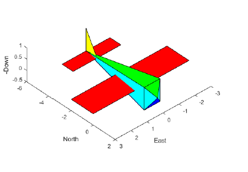
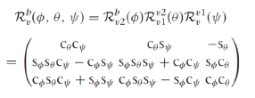
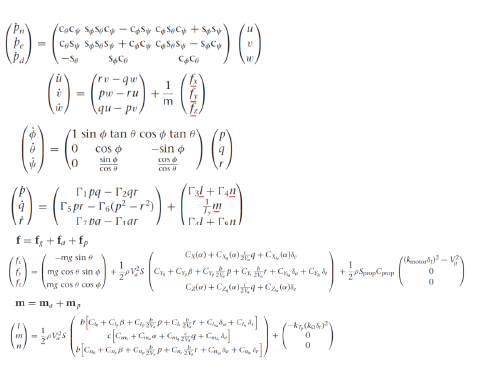
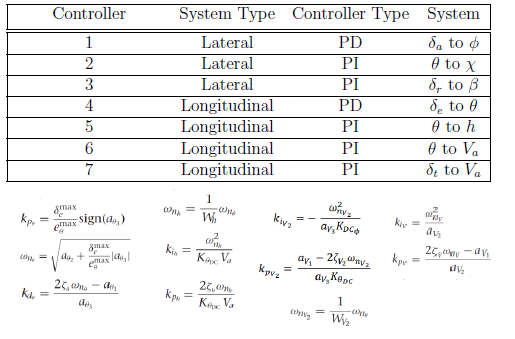

## Autopilot From Scratch: A Fixed-Wing Aircraft Autopilot Model for Basic Testing and Parameter Tuning
By [Fuad Hasan](https://www.linkedin.com/in/fuadhasanm/)

## Overview
In this repository, an undergraduate level flight management autopilot system has been implemented for use in individual projects, be it for passion or recreation, and/or academic purposes, such as graded group projects or assignments. The implementation of the algorithms is entirely in Matlab since it can still be regarded as the most popular platform among undergraduate courses due to its ease of matrix/mathematical algorithm implementation. The main objective of this project is to model a fixed-wing aircraft’s autopilot control that can provide a precise reference tracking.
 

## Methodology
### Transforms
 
For basic visualization purposes, Autopilot/drawAircraft.m file provides a graphical drawing of an aircraft. The drawing will translate/rotate and its axes will change based on its control actions providing visualization of algorithms based on the transforms of the aircraft. An euler angle-based static zyx-rotation has been used, which can be improved by implementing quaternion angles. This feature can, for example, be used for debugging purposes. 

### Trimmed Dynamics, Forces and Moments
 
The above dynamics, forces and moments model has been implemented in the Autopilot/aircraft_dynamics.m and Autopilot/forces_moments.m files. The parameter values used in these files can be accessed in the \Parameters directory.

The model inputs were later trimmed via the trim() function in the Autopilot/compute_trim.m. The paramteres such as cruise speed, course angle or altitude can be changed in this file. 

### Autopilot
The model uses a simple, easy-to-understand PID contorller with trimmed references set in the compute_trim.m file to track. These parameters can be changed in the Autopilot/compute_autopilot_gains file. The PID design and its parameters model are given below:
 
The autopilot() function is composed of the discrete-time implementation of all the PI and PD controllers. The type of controllers had been chosen on the basis of whichever controller results in a closed loop transfer function with a second order characteristic equation. Successive Loop Closure method was adopted to design the gains, which can be improved with other methods such as filtering or such. 

## Conclusion
If you face any issues, you are more than welcome to contact me in my email mentioned in the intro. 

